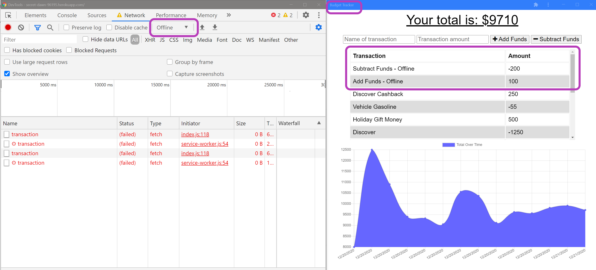
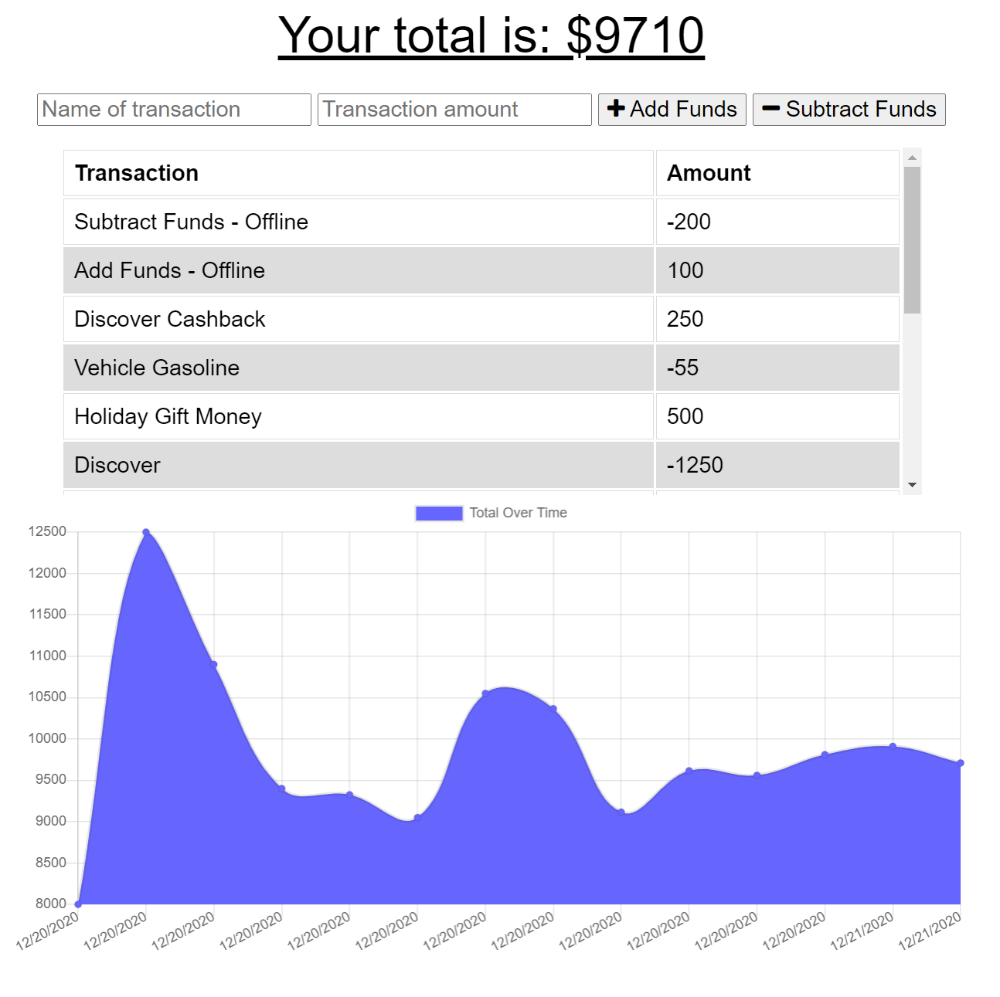

# 18-Online/Offline Budget Tracker
___
## Objective
Add functionality to a Budget Tracker application similar to `17-Week_NoSQL > 01-Activities > 03-Day_IndexedDB > 26-Stu-Mini-Project` by allowing offline access and functionality.
___
## Table of Contents
* [User_Story](#user_story)
* [Installation](#installation)
* [Usage](#usage)
* [License](#license)
* [Contributing](#contributing)
* [Questions](#questions)
* [Application_Links_and_Images](#application_links_and_images)
## User_Story:
AS AN avid traveller  
I WANT to be able to track my withdrawals and deposits with or without a data/internet connection   
SO THAT my account balance is accurate when I am traveling  
___
## Installation
(1) Go to the `server.js` file, right-click, open in integrated terminal, and type: **npm i** (install) to install all required dependencies for the app:   
   - bootstrap
   - compression
   - express
   - lite-server
   - mongoose
   - morgan  

(2) Invoke the app by typing: **node server.js**    
(3) **App is running on port 3000!**   
(4) Go to Google Chrome, and type URL: **localhost:3000**   
(5) The app is now running and the user can add the **Name of transaction**, the **Transaction amount**, and **+ Add Funds** or **- Subtract Funds**.  

(6) Go to upper right corner of Google Chrome and select "Customize and control Google Chrome", select "Install/Open in budget_tracker" from the dropdown menu.  This will create a local version of the app on your device which can be used to add transactions when offline.
   
_____
## Usage
This app allows users a fast and easy way to track their money, and access that information anytime. It allows the following offline functionality:
- Enter deposit transactions (+ Add Funds)
- Enter expense or withdrawal transactions (- Subtract Funds)

While offline, the user can input deposit or withdrawal transactions. When their connection is back online, the information will be uploaded to the remote database, and shown in the table on the page with a graphical representation of the transactions.

_____
## Contributing
ed-sivick, Stack Overflow, Grepper, and BCS support for functionality, code syntax, and Heroku deployment instruction
_____
## Questions
If there are any questions, or if you would prefer more information concerning this app,
please contact the following person at their GitHub profile or email address below:

* [GitHub Profile](https://github.com/ed-sivick)
* ed@sivick.net
_____
## License
You can view more information concerning software licenses at the following link:

* [License](https://opensource.org/licenses/MIT)
_____
## Badges

___
## Application_Links_and_Images  
**Links:**  
Heroku link: (https://secret-dawn-96195.herokuapp.com/)   

**Application Image Examples:** 

<strong>Image of Budget Tracker with Transactions added to app offline on local device</strong>

  
  
 
  

<strong>Image of Budget Tracker with offline Transactions added to Atlas database when User is back online</strong>

  
  
 